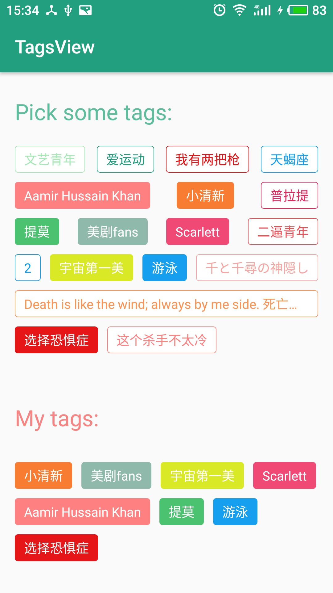

# TagsView
TagsView is a ViewGroup, which displays items in a two-dimensional, like GridView, but the length of item is uncertain.

TagsView是一个可以自动换行的ViewGroup, 用于展示不定长的item, 用法类似于GridView, 可用来展示人物或物品的标签.

##效果图


## 用法
添加依赖:

```java
dependencies {
    compile 'com.tinycand.mobile:TagsView:0.0.1-Beta'
}
```

### 声明
布局文件：
```java
    <com.tinycand.tagsview.TagsView
        android:id="@+id/tagsView_all"
        app:horizontalSpacing="10dp"
        app:verticalSpacing="10dp"
        app:stretchMode="spacingWidth_auto"
        android:paddingLeft="16dp" android:paddingRight="16dp"
        android:paddingTop="5dp" android:paddingBottom="2dp"
        android:layout_width="match_parent" android:layout_height="wrap_content"
        />
```

Java代码:

```java
    TagsView mMyTagsView = (TagsView) findViewById(R.id.tagsView_mine);
    mMyTagsView.setStretchMode(TagsView.NO_STRETCH);
    mMyTagsView.setAdapter(new BaseAdapter(){});
```