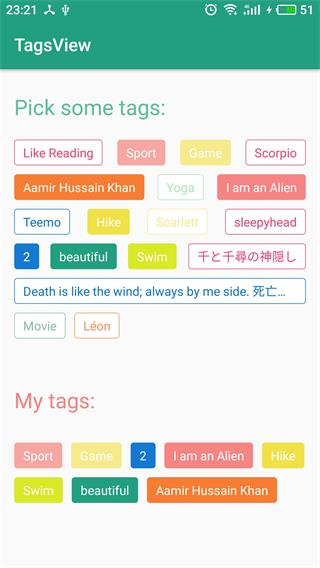

# TagsView
TagsView is a ViewGroup, which displays items in a two-dimensional, like GridView, but the length of item is uncertain.

## Demo

Screenshot



## Usage
### Import Library

Add the following dependency to your build.gradle file:

```groovy
dependencies {
    compile 'com.tinycand.mobile:TagsView:0.0.1-Beta'
}
```

### Layout

Add to Layout

```xml
    <com.tinycand.tagsview.TagsView
        android:id="@+id/tagsView_all"
        app:horizontalSpacing="10dp"
        app:verticalSpacing="10dp"
        app:stretchMode="spacingWidth_auto"
        android:paddingLeft="16dp" android:paddingRight="16dp"
        android:paddingTop="5dp" android:paddingBottom="2dp"
        android:layout_width="match_parent" android:layout_height="wrap_content"
        />
```

### Java Code

Define TagsView in Activity or Fragment:

    TagsView mMyTagsView = (TagsView) findViewById(R.id.tagsView_all);
    mMyTagsView.setStretchMode(TagsView.STRETCH_SPACING_AUTO);
    mMyTagsView.setAdapter(new BaseAdapter(){});


# License
Copyright 2018 TinyCand

Licensed under the Apache License, Version 2.0 (the "License"); you may not use this file except in compliance with the License. You may obtain a copy of the License at

http://www.apache.org/licenses/LICENSE-2.0
Unless required by applicable law or agreed to in writing, software distributed under the License is distributed on an "AS IS" BASIS, WITHOUT WARRANTIES OR CONDITIONS OF ANY KIND, either express or implied. See the License for the specific language governing permissions and limitations under the License.

See LICENSE file for details.

[中文介绍](README_zh.md)